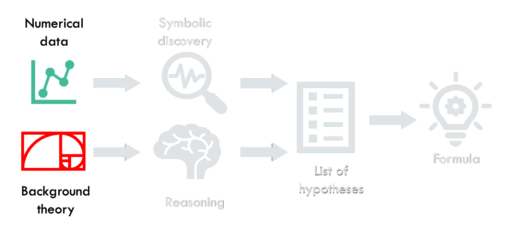

# AI Descartes: Combining Data and Theory for Derivable Scientific Discovery

This repository contains the code and the data used for the experiments in the paper [Combining data and theory for derivable scientific discovery with AI-Descartes](https://rdcu.be/c9IAY).

**Visit our website** for a general overview, references, and some introductory videos: &rarr; [AI-Descartes website](https://ai-descartes.github.io) &larr;

<p align="center">  </p> 


## Folders description:
* `data`: contains the 3 datasets used in the paper (Kepler’s third law of planetary motion, Einstein’s time-dilation formula, Langmuir’s adsorption equation), the data points for 81 FSRD problems and the corresponding background theories (see [data/README.md](data/README.md)). 
* `reasoning`: contains the code for the Reasoning module of AI-Descartes (see [reasoning/README.md](reasoning/README.md))
* `symbolic-regression`: contains the code for the Symbolic Regression module of AI-Descartes (see [symbolic-regression/README.md](symbolic-regression/README.md))


## How to cite

```
@article{AI_Descartes,
	title = {Combining data and theory for derivable scientific discovery with {AI}-{Descartes}},
	volume = {14},
	issn = {2041-1723},
	url = {https://doi.org/10.1038/s41467-023-37236-y},
	doi = {10.1038/s41467-023-37236-y},
	number = {1},
	journal = {Nature Communications},
	author = {Cornelio, Cristina and Dash, Sanjeeb and Austel, Vernon and Josephson, Tyler R. and Goncalves, Joao and Clarkson, Kenneth L. and Megiddo, Nimrod and El Khadir, Bachir and Horesh, Lior},
	month = apr,
	year = {2023},
	pages = {1777},
}
```


